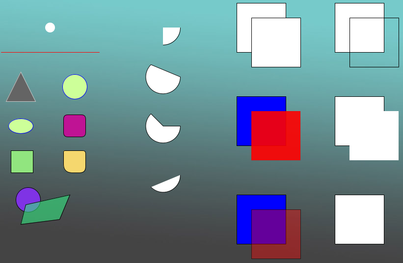

<br />
<div align="center">
  <h3 align="center">Processing Scripts</h3>
  <p align="center">
    Scripts made in Processing, mainly to generate images and animations
</div>

### Installation

1. Download [Processing](https://processing.org/tutorials/) (Java Based) IDE (Currently 4.2)
2. Clone the repo
   ```sh
   git clone https://github.com/DarioArzaba/Processing.git
   cd Processing
   ```
3. Open, edit and run any of the `pde` files provided.

</br>
<div align="center"> <p> Example of PImage with shapes </p> </div>


## License

Distributed under the [MIT License](https://mit-license.org/).

## Contact

Dario Arzaba - dario.arzaba@gmail.com
